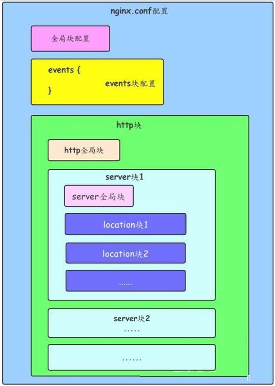
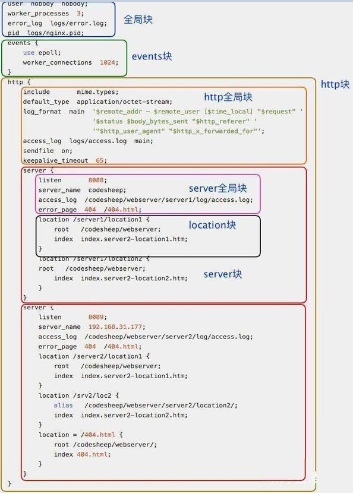

# nginx配置了解
nginx.conf 配置文件存在与 nginx 软件路径下的 conf 文件夹里，例如我的路径 （以windows 为例 D:\software\nginx-1.22.1\conf\nginx.conf）
Nginx配置详解

Nginx是通过配置文件来做到各个功能的实现的。Nginx的配置文件的格式非常合乎逻辑，学习这种格式以及如何使用这种每个部分是基础，这将帮助我们有可能手工创建一个配置文件。
[nginx 学习参考](https://blog.csdn.net/qq_38490457/article/details/108300342)

> nginx.conf 的文件可参考该目录下的 nginx.conf 文件或者参考文章底部

## 1、整体结构图


## 2、配置演示图


## 3、全局块
配置影响Nginx全局的指令。主要包括：

- 配置运行Nginx服务器用户（组）
- worker process数
- Nginx进程
- PID存放路径错误日志的存放路径
- 一个Nginx进程打开的最多文件描述符数目

例如：
```nginx
#配置worker进程运行用户（和用户组），nobody也是一个Linux用户，一般用于启动程序，没有密码
user nobody;
#user www www;

#配置工作进程数目，根据硬件调整，通常等于CPU数量或者2倍于CPU数量
worker_processes 1;

#配置全局错误日志及类型，[debug | info | notice | warn | error | crit]，默认是error
error_log logs/error.log;
#error_log logs/error.log notice;
#error_log logs/error.log info;

#配置进程pid文件
pid logs/nginx.pid;

#一个nginx进程打开的最多文件描述符数目，理论值应该是最多打开文件数（系统的值ulimit -n）与Nginx进程数相除，但是Nginx分配请求并不均匀，所以建议与ulimit -n的值保持一致。
worker_rlimit_nofile 65535;
```

## 4、events块

配置影响Nginx服务器或与用户的网络连接。主要包括：

事件驱动模型的选择

最大连接数的配置

例如：
```nginx
#参考事件模型，use [ kqueue | rtsig | epoll | /dev/poll | select | poll ]; 
#epoll模型是Linux 2.6以上版本内核中的高性能网络I/O模型，如果跑在FreeBSD上面，就用kqueue模型。
use epoll;

#单个进程最大连接数（最大连接数=连接数*进程数）
worker_connections 65535;
```

## 5、http块

可以嵌套多个server，配置代理，缓存，日志定义等绝大多数功能和第三方模块的配置。主要包括：

定义MIMI-Type

自定义服务日志

允许sendfile方式传输文件

连接超时时间

单连接请求数上限


例如：
```nginx
#常见的一些基础配置
include mime.types; #文件扩展名与文件类型映射表
default_type application/octet-stream; #默认文件类型
charset utf-8; #默认编码
server_names_hash_bucket_size 128; #服务器名字的hash表大小
client_header_buffer_size 32k; #上传文件大小限制
large_client_header_buffers 4 64k; #设定请求缓冲
client_max_body_size 8m; #设定请求缓冲
sendfile on; #开启高效文件传输模式，对于普通应用设为on，如果用来进行下载等应用磁盘IO重负载应用，可设置为off，以平衡磁盘与网络I/O处理速度，降低系统的负载。注意：如果图片显示不正常把这个改成off。
autoindex on; #开启目录列表访问，合适下载服务器，默认关闭。
tcp_nopush on; #防止网络阻塞
tcp_nodelay on; #防止网络阻塞
keepalive_timeout 120; #长连接超时时间，单位是秒

#FastCGI相关参数是为了改善网站的性能：减少资源占用，提高访问速度。
fastcgi_connect_timeout 300;
fastcgi_send_timeout 300;
fastcgi_read_timeout 300;
fastcgi_buffer_size 64k;
fastcgi_buffers 4 64k;
fastcgi_busy_buffers_size 128k;
fastcgi_temp_file_write_size 128k;

#gzip模块设置
gzip on; #开启gzip压缩输出
gzip_min_length 1k; #最小压缩文件大小
gzip_buffers 4 16k; #压缩缓冲区
gzip_http_version 1.0; #压缩版本（默认1.1，前端如果是squid2.5请使用1.0）
gzip_comp_level 2; #压缩等级
gzip_types text/plain application/x-javascript text/css application/xml; #压缩类型
gzip_vary on; #增加响应头'Vary: Accept-Encoding'
limit_zone crawler $binary_remote_addr 10m; #开启限制IP连接数的时候需要使用
```

## 6、server块

配置虚拟主机的相关参数，一个http中可以有多个server。主要包括：

配置网络监听

配置https服务

基于名称的虚拟主机配置

基于IP的虚拟主机配置


例如：
```nginx
#虚拟主机的常见配置
server {
    listen       80; #配置监听端口
    server_name  localhost; #配置服务名
    charset utf-8; #配置字符集
    access_log  logs/host.access.log  main; #配置本虚拟主机的访问日志
    
    location / {
        root html; #root是配置服务器的默认网站根目录位置，默认为Nginx安装主目录下的html目录
        index index.html index.htm; #配置首页文件的名称
    }
    
    error_page 404             /404.html; #配置404错误页面
    error_page 500 502 503 504 /50x.html; #配置50x错误页面
}

#配置https服务，安全的网络传输协议，加密传输，端口443
server {
    listen       443 ssl;
    server_name  localhost;

    ssl_certificate      cert.pem;
    ssl_certificate_key  cert.key;

    ssl_session_cache    shared:SSL:1m;
    ssl_session_timeout  5m;

    ssl_ciphers  HIGH:!aNULL:!MD5;
    ssl_prefer_server_ciphers  on;

    location / {
        root   html;
        index  index.html index.htm;
    }
}
```

## 7、location块

配置请求的路由，以及各种页面的处理情况。主要包括：

请求根目录配置更改

网站默认首页配置

location的URI

例如：
```nginx
root html; #root是配置服务器的默认网站根目录位置，默认为Nginx安装主目录下的html目录
index index.html index.htm; #配置首页文件的名称

proxy_pass http://127.0.0.1:88; #反向代理的地址
proxy_redirect off; #是否开启重定向
#后端的Web服务器可以通过X-Forwarded-For获取用户真实IP
proxy_set_header X-Real-IP $remote_addr;
proxy_set_header X-Forwarded-For $proxy_add_x_forwarded_for;
proxy_set_header Host $host;
#以下是一些反向代理的配置，可选。
client_max_body_size 10m; #允许客户端请求的最大单文件字节数
client_body_buffer_size 128k; #缓冲区代理缓冲用户端请求的最大字节数，
proxy_connect_timeout 90; #nginx跟后端服务器连接超时时间（代理连接超时）
proxy_send_timeout 90; #后端服务器数据回传时间（代理发送超时）
proxy_read_timeout 90; #连接成功后，后端服务器响应时间（代理接收超时）
proxy_buffer_size 4k; #设置代理服务器（Nginx）保存用户头信息的缓冲区大小
proxy_buffers 4 32k; #proxy_buffers缓冲区，网页平均在32k以下的设置
proxy_busy_buffers_size 64k; #高负荷下缓冲大小（proxy_buffers*2）
proxy_temp_file_write_size 64k;  #设定缓存文件夹大小
```
location的URI：

描述：该指令用于匹配URL

语法：
```nginx
location [ = | ~ | ~* | ^~ ] uri {
    
}
```

通配符：

- =：用于不含正则表达式的uri前，要求请求字符串与uri严格匹配，如果匹配成功，就停止继续向下搜索并立即处理该请求。

- ~：用于表示uri包含正则表达式，并且区分大小写。

- ~*：用于表示uri包含正则表达式，并且不区分大小写。

- ^~：用于不含正则表达式的uri前，要求Nginx服务器找到标识uri和请求字符串匹配度最高的location后，立即使用此location处理请求，而不再使用location块中的正则uri和请求字符串做匹配。


注意：如果uri包含正则表达式，则必须要有~或者~*标识。

## 刚down下来的 nginx.conf
```
#user  nobody;
worker_processes  1;

#error_log  logs/error.log;
#error_log  logs/error.log  notice;
#error_log  logs/error.log  info;

#pid        logs/nginx.pid;


events {
    worker_connections  1024;
}


http {
    include       mime.types;
    default_type  application/octet-stream;

    #log_format  main  '$remote_addr - $remote_user [$time_local] "$request" '
    #                  '$status $body_bytes_sent "$http_referer" '
    #                  '"$http_user_agent" "$http_x_forwarded_for"';

    #access_log  logs/access.log  main;

    sendfile        on;
    #tcp_nopush     on;

    #keepalive_timeout  0;
    keepalive_timeout  65;

    #gzip  on;

    server {
        listen       80;
        server_name  localhost;

        #charset koi8-r;

        #access_log  logs/host.access.log  main;

        location / {
            root   html;
            index  index.html index.htm;
        }

        #error_page  404              /404.html;

        # redirect server error pages to the static page /50x.html
        #
        error_page   500 502 503 504  /50x.html;
        location = /50x.html {
            root   html;
        }

        # proxy the PHP scripts to Apache listening on 127.0.0.1:80
        #
        #location ~ \.php$ {
        #    proxy_pass   http://127.0.0.1;
        #}

        # pass the PHP scripts to FastCGI server listening on 127.0.0.1:9000
        #
        #location ~ \.php$ {
        #    root           html;
        #    fastcgi_pass   127.0.0.1:9000;
        #    fastcgi_index  index.php;
        #    fastcgi_param  SCRIPT_FILENAME  /scripts$fastcgi_script_name;
        #    include        fastcgi_params;
        #}

        # deny access to .htaccess files, if Apache's document root
        # concurs with nginx's one
        #
        #location ~ /\.ht {
        #    deny  all;
        #}
    }


    # another virtual host using mix of IP-, name-, and port-based configuration
    #
    #server {
    #    listen       8000;
    #    listen       somename:8080;
    #    server_name  somename  alias  another.alias;

    #    location / {
    #        root   html;
    #        index  index.html index.htm;
    #    }
    #}


    # HTTPS server
    #
    #server {
    #    listen       443 ssl;
    #    server_name  localhost;

    #    ssl_certificate      cert.pem;
    #    ssl_certificate_key  cert.key;

    #    ssl_session_cache    shared:SSL:1m;
    #    ssl_session_timeout  5m;

    #    ssl_ciphers  HIGH:!aNULL:!MD5;
    #    ssl_prefer_server_ciphers  on;

    #    location / {
    #        root   html;
    #        index  index.html index.htm;
    #    }
    #}

}
```